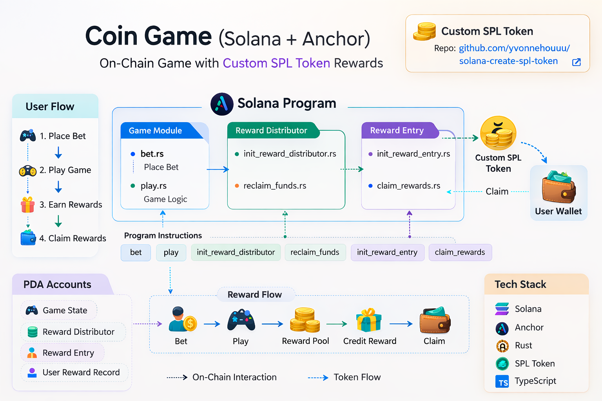

# Coin Game (Solana Anchor Program)

A fully on-chain **coin game smart contract** built with **Solana + Anchor**, integrated with a **custom token reward system**.

This project demonstrates how to build a decentralized game with:

* On-chain game logic
* Token-based reward distribution
* Player reward tracking
* Claimable rewards system

Everything is written **from scratch**, including the reward distribution logic.


## Overview

Coin Game is a simple blockchain game where players:

1. **Place bets**
2. **Play the game**
3. **Earn rewards**
4. **Claim rewards in custom tokens**

The program also includes a **reward distributor system** that manages token pools and distributes rewards to players.


### Custom SPL Token

The reward system in this project uses a **custom SPL token**.

The token creation process (mint creation, metadata, and setup) is documented in a separate repository:

🔗 https://github.com/yvonnehouuu/solana-create-spl-token

That repo demonstrates how to create an SPL token from scratch on Solana.



## Features

* On-chain game logic
* Custom SPL token reward system
* Reward distributor pool
* Player reward tracking
* Claimable reward entries
* Anchor-based development
* TypeScript test suite


## Architecture

The project is divided into several modules.

```
programs/coin-game2/src
│
├── game
│   ├── bet.rs
│   ├── play.rs
│   ├── state.rs
│
├── reward_distributor
│   ├── init_reward_distributor.rs
│   ├── reclaim_funds.rs
│   ├── state.rs
│
├── reward_entry
│   ├── init_reward_entry.rs
│   ├── claim_rewards.rs
│   ├── state.rs
│
├── errors.rs
└── lib.rs
```

### Game Module

Handles the core gameplay.

Functions:

* `bet` — player places a bet
* `play` — executes game logic

Files:

```
game/
bet.rs
play.rs
state.rs
```


### Reward Distributor

Manages the reward pool that distributes tokens to players.

Functions:

* `init_reward_distributor`
* `reclaim_funds`

Files:

```
reward_distributor/
init_reward_distributor.rs
reclaim_funds.rs
state.rs
```


### Reward Entry

Tracks individual player rewards.

Functions:

* `init_reward_entry`
* `claim_rewards`

Files:

```
reward_entry/
init_reward_entry.rs
claim_rewards.rs
state.rs
```


## Program Instructions

Main program entrypoints:

```
play
bet
init_reward_distributor
reclaim_funds
init_reward_entry
claim_rewards
```

Example:

```rust
pub fn play(ctx: Context<PlayCtx>, ix: PlayIx) -> Result<()>
```


## Tech Stack

* **Solana**
* **Anchor Framework**
* **Rust**
* **TypeScript**
* **SPL Token**
* **Mocha / Chai testing**

Dependencies:

```
@coral-xyz/anchor
@solana/spl-token
@cardinal/common
```


## Setup

Install dependencies:

```bash
yarn install
```

or

```bash
npm install
```


## Build Program

```bash
anchor build
```


## Deploy Program

```bash
anchor deploy
```


## Run Tests

```bash
anchor test
```

Tests are located in:

```
tests/
coin-game2.ts
```


## Project Structure

```
coin-game2
│
├── programs
│   └── coin-game2
│
├── tests
│   └── coin-game2.ts
│
├── migrations
│   └── deploy.ts
│
├── Anchor.toml
├── Cargo.toml
├── package.json
└── tsconfig.json
```


## Security Notes

This project is for **learning and experimentation**.

Before using in production:

* Perform a security audit
* Add overflow protection
* Verify randomness source
* Add access control where needed


## Author

Built from scratch as an experimental **Solana on-chain game with token rewards**.

